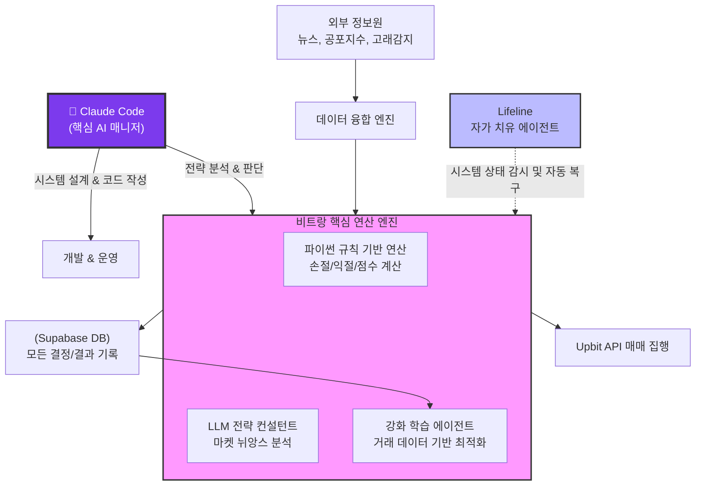

# 🚀 비트랑 (Bit-Rang) - Intelligent Crypto Trading Ecosystem

> **Powered by Claude Code** — Anthropic의 AI 코딩 에이전트가 설계, 구축, 운영하는 자율 트레이딩 시스템

---

## 🤖 Claude Code: 이 프로젝트의 핵심 AI 매니저

**비트랑은 [Claude Code](https://docs.anthropic.com/en/docs/claude-code)에 의해 탄생하고 운영되는 프로젝트입니다.**

Claude Code는 Anthropic이 만든 터미널 기반 AI 코딩 에이전트로, 이 프로젝트에서 다음 역할을 수행합니다:

| 역할 | 설명 |
|:---|:---|
| **🏗️ 아키텍트** | 전체 시스템 설계, 에이전트 아키텍처, DB 스키마 설계를 Claude Code가 수행 |
| **💻 개발자** | 모든 Python 스크립트, SQL 마이그레이션, 셸 스크립트를 Claude Code가 작성 |
| **🧠 전략 분석가** | `claude -p` 비대화형 모드로 시장 데이터를 분석하고 매매 결정을 내림 |
| **🔧 운영자** | 대화형 세션(`claude`)으로 전략 수정, 피드백 반영, 디버깅, 성과 분석 수행 |
| **📚 교육자** | 빈 폴더에서 시작하여 프롬프트만으로 전체 시스템을 구축하는 교육 커리큘럼 제공 |

### Claude Code 실행 모드

```bash
# 1. 비대화형 모드 — 자동 분석 & 매매 실행 (cron 자동화)
bash scripts/run_analysis.sh 2>/dev/null | claude -p --dangerously-skip-permissions

# 2. 대화형 모드 — 전략 관리, 피드백, 수동 개입
cd ~/claude-coin-trading && claude

# 3. 에이전트 모드 — Python 에이전트가 자율 판단 (LLM 호출 없이 빠르고 경제적)
bash scripts/run_agents.sh
```

### 핵심 설계 철학

> **"매매 로직을 코드로 하드코딩하지 않는다."**
>
> `strategy.md`에 자연어로 전략을 정의하면, Claude Code가 데이터를 해석하여 자율적으로 판단합니다.
> Python 스크립트는 데이터 수집과 API 호출만 담당하고, **지능은 Claude에게 위임**합니다.

---

## 🌟 프로젝트 소개

**비트랑(Bit-Rang)**은 파이썬의 정밀한 규칙 기반 연산과 최신 인공지능의 통찰을 융합한 차세대 트레이딩 솔루션입니다. 매매 결정은 수학적 논리에 따라 엄격히 집행되며, 인공지능은 그 과정에 깊은 통찰을 더합니다. 특히, 스스로의 상태를 진단하고 치유하는 **자가 복구(Auto-Healing) 에이전트**와 매 거래마다 똑똑해지는 **강화 학습(RL)** 시스템이 결합되어 365일 지치지 않는 수익을 추구합니다.

---

## 📊 시스템 구조



---

## 📑 목차

- [🤖 Claude Code: 핵심 AI 매니저](#-claude-code-이-프로젝트의-핵심-ai-매니저)
- [🌟 프로젝트 소개](#-프로젝트-소개)
- [📊 시스템 구조](#-시스템-구조)
- [⚙️ 설정 및 설치 가이드](#️-설정-및-설치-가이드)
- [🕹️ 에이전트 아키텍처](#️-에이전트-아키텍처)
- [🧠 핵심 운영 엔진](#-핵심-운영-엔진-규칙과-지능의-융합)
- [📈 강화 학습 및 진화 메커니즘](#-강화-학습-및-진화-메커니즘)
- [🏥 Lifeline: 자가 치유 에이전트](#-lifeline-자가-치유-및-헬스케어)
- [🌐 외부 데이터 소스](#-외부-데이터-소스-및-정보-통합)
- [🗄️ 데이터베이스 및 기록 관리](#️-데이터베이스-및-기록-관리)
- [📚 교육 커리큘럼](#-교육-커리큘럼)

---

## ⚙️ 설정 및 설치 가이드

### 사전 요구 사항

| 도구 | 용도 | 설치 |
|:---|:---|:---|
| **Claude Code** | AI 매니저 (분석, 코딩, 운영) | `npm install -g @anthropic-ai/claude-code` |
| **Python 3.10+** | 데이터 수집, 에이전트 실행 | [python.org](https://python.org) |
| **Node.js 18+** | Claude Code 실행 환경 | [nodejs.org](https://nodejs.org) |

### 1. 환경 변수 설정

프로젝트 루트에 `.env` 파일을 생성하고 다음 정보를 입력합니다:

| 변수명 | 설명 | 필수 |
|:---|:---|:---|
| `UPBIT_ACCESS_KEY` | Upbit API 엑세스 키 | **필수** |
| `UPBIT_SECRET_KEY` | Upbit API 시크릿 키 | **필수** |
| `BINANCE_API_KEY` | Binance Futures API 키 | **필수** |
| `BINANCE_API_SECRET` | Binance Futures API 시크릿 키 | **필수** |
| `GEMINI_API_KEY` | 하이브리드 결정을 돕는 Gemini AI 키 | **필수** |
| `SUPABASE_URL` | 데이터 기록 및 RL용 서버 주소 | **필수** |
| `SUPABASE_SERVICE_ROLE_KEY` | Supabase 서비스 역할 키 | **필수** |
| `TELEGRAM_BOT_TOKEN` | 텔레그램 알림 봇 토큰 | 선택 |
| `TELEGRAM_CHAT_ID` | 텔레그램 수신 채팅 ID | 선택 |
| `DRY_RUN` | 실전 매매 여부 (`true`: 테스트, `false`: 실전) | 선택 |

---

### 🔑 Binance Futures API 키 생성 가이드 (반드시 순서대로!)

> ⚠️ **매우 중요:** Binance API 키는 **반드시 아래 순서를 모두 완료한 후에 생성**해야 합니다.
> 선물(Futures) 거래를 활성화하기 전에 API 키를 먼저 만들면, 해당 키에 **Futures 권한이 빠집니다.**
> 이 경우 키를 삭제하고 처음부터 다시 만들어야 하므로 순서를 꼭 지켜 주세요.

#### Step 1: Binance 계정 생성 및 KYC 인증

1. [binance.com](https://www.binance.com) 접속 → **Register** 클릭
2. 이메일/전화번호로 회원가입
3. **신원 인증(KYC)** 완료 (여권 또는 신분증 필요)
   - KYC를 완료하지 않으면 선물 거래 및 API 생성이 불가합니다

#### Step 2: 선물(Futures) 거래 활성화 🎯

1. Binance 로그인 후 상단 메뉴에서 **[Derivatives]** → **[USDS-M Futures]** 클릭
2. 선물 거래 페이지에 처음 접속하면 **"Open Now"** 또는 **"선물 계정 개설"** 버튼이 표시됩니다
3. 이 버튼을 클릭하여 선물 거래 계정을 활성화합니다

#### Step 3: 선물 거래 퀴즈 통과 📝

선물 계정을 활성화하면 **의무 퀴즈**가 나옵니다:
- 레버리지, 마진, 청산 등에 대한 기본 지식 퀴즈 (약 12~15문항)
- **모든 문항을 정답으로 통과**해야 선물 거래가 활성화됩니다
- 오답 시 재시도 가능하며, 인터넷에서 답을 검색해도 괜찮습니다
- 퀴즈를 통과하지 않으면 Futures API 권한을 얻을 수 없습니다

#### Step 4: Futures 지갑에 자금 입금 💰

1. **[Wallet]** → **[Futures]** 로 이동
2. **[Transfer]** 버튼 클릭 → Spot Wallet에서 Futures Wallet으로 자금 이동
3. **최소 $100 (약 100 USDT)** 정도를 Futures 지갑에 입금
   - 이 금액은 실제 거래에 사용되는 것이 아닙니다
   - Futures 계정의 "유효한 사용자"임을 인증하기 위한 최소 잔액입니다
   - 비트랑은 Binance에서 **직접 거래하지 않고**, 롱/숏 비율, 펀딩비 등 **시장 데이터만 수집**합니다

#### Step 5: 거래 수수료(Fee) 등급 확인 📊

1. **[Dashboard]** → **[Fee Rate]** 또는 [binance.com/en/fee/trading](https://www.binance.com/en/fee/trading) 접속
2. **Futures** 탭에서 자신의 수수료 등급(Fee Tier)을 확인합니다
3. 일반 사용자는 **VIP 0** (Maker: 0.02% / Taker: 0.05%) 에 해당합니다
4. 이 정보가 표시된다면 Futures 거래가 정상적으로 활성화된 상태입니다

#### Step 6: API 키 생성 (이 순서가 마지막!) 🔐

> ✅ 위 Step 1~5를 **모두 완료한 후**에 API 키를 생성합니다.

1. **[Profile 아이콘]** → **[API Management]** 클릭
   - 또는 직접 접속: [binance.com/en/my/settings/api-management](https://www.binance.com/en/my/settings/api-management)
2. **[Create API]** → **"System generated"** 선택 → 라벨 입력 (예: `bitrang-futures`)
3. 2FA 인증(Google Authenticator 또는 SMS) 완료
4. API 키 생성 후 **권한 설정**:

   | 권한 | 설정 | 이유 |
   |:---|:---|:---|
   | ✅ Enable Reading | **ON** | 시장 데이터 조회 (필수) |
   | ❌ Enable Spot & Margin Trading | OFF | Spot 거래 불필요 |
   | ✅ Enable Futures | **ON** | 선물 데이터 조회 (필수) |
   | ❌ Enable Withdrawals | **OFF** | 출금 절대 불필요 |

5. **IP 제한 설정 (강력 권장)**:
   - **Restrict access to trusted IPs only** 선택
   - 본인의 공인 IP 주소를 입력 (이 시스템의 IP: 확인 방법 → 터미널에서 `curl ifconfig.me`)
6. API Key와 Secret Key를 `.env` 파일에 입력합니다. (양식은 `.env.example` 파일을 참고하세요)

> ⚠️ **Secret Key는 생성 직후에만 표시됩니다.** 반드시 즉시 복사하여 안전한 곳에 저장하세요.
> 페이지를 벗어나면 다시 확인할 수 없으며, 새로 만들어야 합니다.

#### 체크리스트 ✅

API 키 생성 전에 아래 항목을 모두 확인하세요:

- [ ] KYC 신원 인증 완료
- [ ] Futures 거래 계정 개설 (Open Now 클릭)
- [ ] 선물 퀴즈 전 문항 통과
- [ ] Futures 지갑에 최소 $100 (USDT) 입금
- [ ] Fee Rate 페이지에서 Futures 수수료 등급 확인
- [ ] **↑ 위 항목 모두 완료 후 →** API 키 생성

---

### 2. 설치 및 실행

```bash
# 1. 의존성 설치
bash setup.sh

# 2-A. 에이전트 모드 실행 (권장)
bash scripts/run_agents.sh

# 2-B. Claude 대화형 모드
claude --dangerously-skip-permissions

# 2-C. LLM 프롬프트 모드 (레거시)
bash scripts/run_analysis.sh 2>/dev/null | claude -p --dangerously-skip-permissions
```

---

## 🕹️ 에이전트 아키텍처

비트랑의 에이전트 시스템은 **감독(Orchestrator)**이 시장 상황을 판단하고, 최적의 전략 에이전트를 자율 선택합니다.

```
Orchestrator (감독)
  ├── 시장 상태 종합 평가 (danger_score + opportunity_score)
  ├── 전략 전환 판단 (DB 학습 반영)
  └── 활성 에이전트에게 위임
       ├── 🛡️ ConservativeAgent — 보수적 (70점 이상만 매수, 자산 보전)
       ├── ⚖️ ModerateAgent    — 보통 (55점, 균형 매매)
       └── 🔥 AggressiveAgent  — 공격적 (45점, 고수익 추구)

ExternalDataAgent (외부 데이터)
  ├── FGI, 뉴스, 고래 추적, 바이낸스 심리
  └── Data Fusion 종합 점수
```

### 감독의 전략 전환 규칙

| 조건 | 전환 | 직행 허용 |
|:---|:---|:---:|
| danger ≥ 70 | → 보수적 | ✅ 공격→보수 직행 |
| danger 50~69 + 보통 | → 보수적 | — |
| opportunity ≥ 60 + danger < 30 | → 공격적 | ✅ 보수→공격 직행 |
| 횡보 (둘 다 < 25) | → 보통 | — |

---

## 🧠 핵심 운영 엔진: 규칙과 지능의 융합

비트랑의 결정 시스템은 **'논리'**와 **'직관'**의 하이브리드 구조입니다.

* **파이썬 규칙 연산 (Rules-Based):**
    * `strategy.md`에 정의된 50개 이상의 수학적 지표를 기반으로 결정론적(Deterministic) 점수를 산출합니다.
    * 감정에 흔들리지 않는 손절(Stop-loss), 익절(Take-profit) 원칙을 고수합니다.
* **인공지능 컨설턴트 (AI-Assisted):**
    * LLM(Gemini)이 현재 시장의 비정형 데이터(뉴스 뉘앙스, SNS 감성)를 분석하여 규칙 기반 점수에 **가중치**를 더합니다.
    * 단순한 "사라 마라"가 아닌, **"왜 사야 하는가"**에 대한 근거를 제공합니다.

---

## 📈 강화 학습 및 진화 메커니즘

비트랑은 시간이 지날수록 강력해집니다.

1. **경험의 기록:** 모든 매매 시도, 성공, 실패 사례는 즉시 데이터베이스에 기록됩니다.
2. **RL 시뮬레이션:** `rl_hybrid/` 모듈은 기록된 데이터를 바탕으로 현재의 규칙 임계값이 최적인지 지속적으로 시뮬레이션합니다.
3. **동적 조정:** 강화 학습 결과에 따라 `DecisionBlender`의 가중치가 자동으로 조정되어 미래의 결정에 반영됩니다.

---

## 🏥 Lifeline: 자가 치유 및 헬스케어

24시간 무중단 가동을 위해 비트랑 내부에는 **Lifeline 에이전트**가 상주합니다.

* **자가 진단:** API 호출 지연, 에러 로그 발생, 프로세스 중단 등을 실시간 감시합니다.
* **자동 치유 (Self-Healing):**
    * 네트워크 오류 시 세션 자동 재시작.
    * 비정상적인 매매 패턴 감지 시 즉시 안전 모드(Safety Mode) 전환.
    * 시스템 리소스 부족 시 불필요한 캐시 정리 및 재부팅 예약.

---

## 🌐 외부 데이터 소스 및 정보 통합

비트랑은 전 세계의 조각난 정보를 융합하여 하나의 결정을 내립니다.

| 소스 | API | 정보 |
|:---|:---|:---|
| **Upbit** | `api.upbit.com/v1` | 시세, 호가, 캔들, 매매 실행 |
| **Binance Futures** | `fapi.binance.com` | 롱숏비율, 펀딩비, 김치프리미엄 |
| **Alternative.me** | `api.alternative.me/fng/` | 공포/탐욕 지수 (FGI) |
| **Tavily** | `api.tavily.com/search` | 뉴스 검색 + 감성 분석 |
| **mempool.space** | `mempool.space/api` | 고래 추적, 거래소 입출금 |
| **Yahoo Finance** | `query1.finance.yahoo.com` | S&P500, DXY, 금, 유가, 국채 |

---

## 🗄️ 데이터베이스 및 기록 관리

모든 활동은 **Supabase PostgreDB**에 저장되어 투명하게 관리됩니다.

| 테이블 | 용도 |
|:---|:---|
| `decisions` | 비트랑이 내린 모든 결정과 그 이유 |
| `execution_logs` | 실제 API를 통해 집행된 매매 내역 |
| `system_health_logs` | Lifeline 에이전트의 치유 기록 |
| `market_context_log` | 매 순간의 시장 환경 스냅샷 (RL 학습용) |
| `agent_switches` | 에이전트 전환 이력 + 성과 학습 |
| `portfolio_snapshots` | 포트폴리오 잔고 및 수익률 기록 |

---

## 🔒 안전장치

| 파라미터 | 기본값 | 설명 |
|:---|:---|:---|
| `DRY_RUN` | `true` | true: 분석만, false: 실제 매매 |
| `MAX_TRADE_AMOUNT` | `100000` | 1회 매매 금액 상한 (KRW) |
| `MAX_DAILY_TRADES` | `6` | 일일 매매 횟수 상한 |
| `MAX_POSITION_RATIO` | `0.5` | 총 자산 대비 최대 투자 비율 |
| `EMERGENCY_STOP` | `false` | true: 모든 매매 즉시 중지 |

---

## 📚 교육 커리큘럼

이 프로젝트는 **빈 폴더에서 시작하여 Claude Code에 프롬프트를 입력하면서 자동매매 시스템을 직접 구축**하는 교육 과정입니다.

| Step | 주제 | 핵심 프롬프트 |
|:---:|:---|:---|
| 0 | 환경 준비 | "Python 가상환경을 만들고 의존성을 설치해줘" |
| 1 | 시장 데이터 수집 | "Upbit API로 BTC/KRW 데이터를 수집하는 스크립트를 만들어줘" |
| 2 | 공포탐욕지수 | "Alternative.me API로 FGI를 수집해줘" |
| 3 | 뉴스 수집 | "Tavily로 BTC 뉴스를 수집해줘" |
| 4 | 차트 캡처 | "Playwright로 Upbit 차트를 스크린샷으로 캡처해줘" |
| 5 | 포트폴리오 | "내 계좌 잔고를 조회하는 스크립트를 만들어줘" |
| 6 | 전략 정의 | "strategy.md에 보수적 매매 전략을 작성해줘" |
| 7 | 매매 실행 | "시장가 매수/매도 스크립트를 안전장치와 함께 만들어줘" |
| 8 | 텔레그램 알림 | "매매 결과를 텔레그램으로 알림하는 스크립트를 만들어줘" |
| 9 | 데이터베이스 | "Supabase DB 스키마를 설계해줘" |
| 10 | 분석 파이프라인 | "모든 스크립트를 파이프라인으로 연결해줘" |
| 11 | 시장 분석 실행 | "비트코인 시장을 분석하고 매매 결정을 내려줘" |
| 12 | 자동화 | "cron으로 8시간 간격 자동 실행을 설정해줘" |

> 상세 커리큘럼: [CLAUDE.md](CLAUDE.md)

---

## 🗂️ 프로젝트 구조

```
claude-coin-trading/
├── CLAUDE.md                  # Claude Code 프로젝트 지침 & 교육 커리큘럼
├── README.md                  # 이 파일
├── strategy.md                # 매매 전략 (자연어, LLM이 해석)
├── .env                       # API 키 (git 추적 제외)
├── requirements.txt           # Python 의존성
├── agents/                    # 에이전트 기반 자율 매매 시스템
│   ├── orchestrator.py        #   감독 에이전트 (전략 전환 + 매매 판단)
│   ├── base_agent.py          #   추상 기본 클래스
│   ├── conservative.py        #   🛡️ 보수적 에이전트
│   ├── moderate.py            #   ⚖️ 보통 에이전트
│   ├── aggressive.py          #   🔥 공격적 에이전트
│   └── external_data.py       #   외부 데이터 수집 에이전트
├── kimchirang/                # 🌶️ 김치랑 핵심 엔진
│   ├── main.py                #   메인 실행 루프
│   ├── kp_engine.py           #   김치프리미엄 엔진
│   ├── execution.py           #   매매 실행 로직
│   ├── state.py               #   상태 관리
│   └── rl_env.py              #   강화학습 환경
├── rl_hybrid/                 # 🧠 RL 하이브리드 학습
│   ├── nodes/                 #   분산 노드 (main_brain, rl_worker 등)
│   └── launchers/             #   실행 런처
├── scripts/                   # 📜 유틸리티 스크립트
├── supabase/migrations/       # 🗄️ DB 마이그레이션 SQL
├── web/                       # 🌐 대시보드 웹 인터페이스
└── docs/                      # 📚 상세 문서
```

---

> **"비트랑은 단순한 봇이 아닙니다. Claude Code와 함께 자라나는 디지털 트레이딩 자산입니다."**
